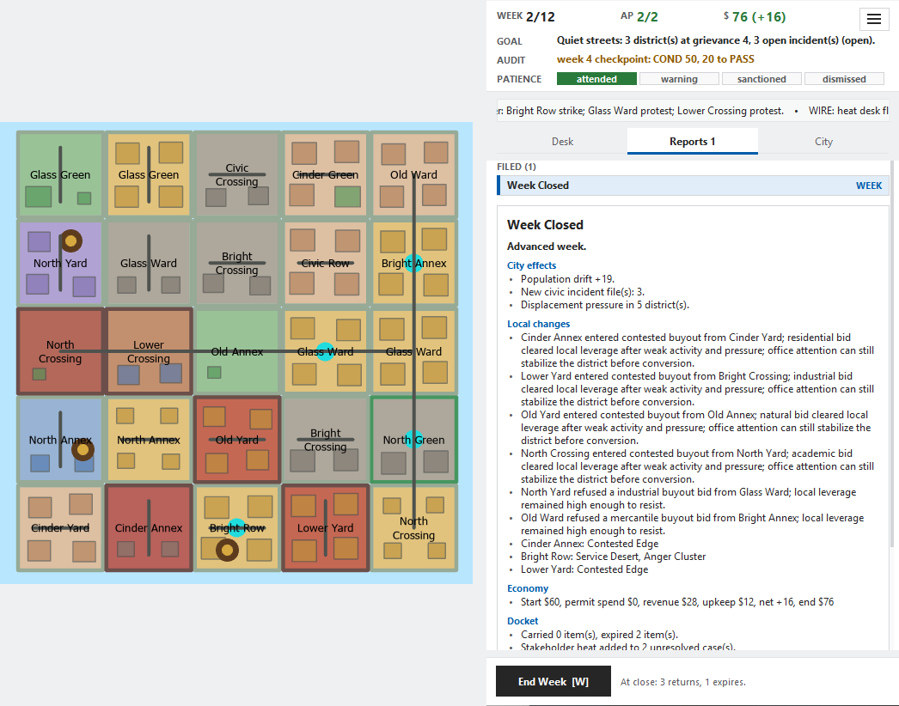
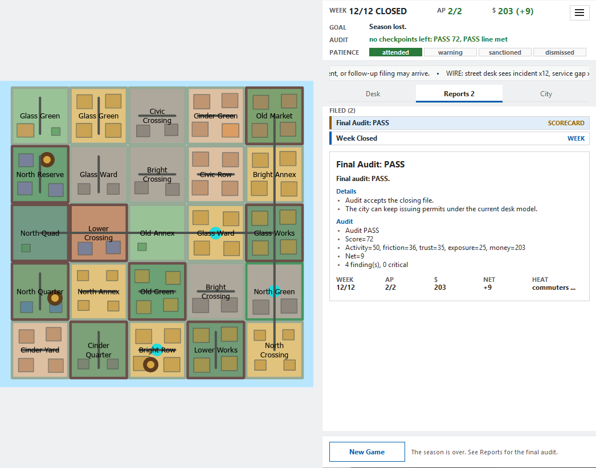

# Permit Office

Permit Office is a turn-based city planning game that runs inside ArcGIS Pro.
You play as a municipal permit clerk trying to keep a strange city functional
through inspections, approvals, denials, mitigation conditions, and weekly audit
reports.

The premise is a joke about bureaucracy. The rules are not: every permit is tied
to map geometry, district state, stakeholder pressure and recurring costs, and
its consequences show up on the map.

> **Status: public beta.** v0.97.0 reworks the loop (seeded goals, an audit
> ladder, player initiatives, no real-time clock) and the dashboard (a narrow,
> resizable pane that opens on a main menu), and was played through full
> seasons in ArcGIS Pro 3.7. The game needs ArcGIS Pro 3.3+ with ArcPy (tested
> on 3.6 and 3.7). The pure-Python rules and tests run without it.


## How It Plays

A season is 12 office weeks. The clerk has 2 AP a week, a small budget, and a
council that audits the office at weeks 4, 8 and 12.

1. **Pick a goal.** New Game offers three goals drawn from the seed, such as
   growing one district type by three districts, quieting every grievance, or
   raising city trust to 55. Meet the one you file by week 12 to win the season.
   Any other goal the city happens to meet counts as an achievement.
2. **Work the docket.** Two new cases arrive each week, plus follow-ups. Select
   one to draw its proposed exhibit and select its target districts on the map.
   Inspect it (1 AP) to reveal risk, then issue it, issue it with conditions,
   or deny it. Each case says what happens if you ignore it: it returns, expires,
   or expires and leaves trouble behind.
3. **Start one initiative.** Once a week, earmark a district type so it wins
   neighbor buyouts and its kind of case comes up more often, or fund a civic
   action or a market push on the districts selected on the map.
4. **End the week.** Ignored cases build district pressure, heat and grievance.
   Features age, the economy settles, districts drift, and stronger neighbors
   bid for weak districts.
5. **Survive the audits.** A failed checkpoint audit costs council patience
   (warning, then sanctioned with one AP less, then dismissed). A pass wins it
   back.

Approvals can spawn points, lines, or polygons on the map: vendor markets,
utility trenches, fire coverage areas, public art grants, corridors, reserves,
incidents, inspection orders, and other civic paperwork with consequences.

## Why I Built It

Permit Office uses ArcGIS Pro as a game engine. Feature classes are the save
file, map selections are the input, and ArcPy geometry operations are part of
the rules.

The longer aim is live-updating city simulations built from the standard ArcGIS
tools analysts already use, for work like disaster readiness, service
disruption and emergency rerouting. A game is a demanding first test of that
idea, because it has to stay correct and responsive while the map changes every
turn.

It is also a small study in paperwork as play. You are a permit office, not a
mayor, and you shape the city by filing, approving, delaying and explaining
official decisions.

## Design Notes

- **The geodatabase is the game state.** Districts, docket rows, projects,
  commands, logs and permit features all live in one file geodatabase.
- **Space drives the rules.** Selected districts, adjacency, buffers and feature
  geometry decide who a decision affects.
- **The rules are plain Python.** The simulation runs and tests without ArcGIS
  Pro; ArcPy handles storage, spatial analysis and the map.
- **Cities come from a seed.** District names, populations, services,
  grievances, hazards, housing pressure, stakeholder heat and the docket are
  all generated, and the same seed gives the same city.
- **Districts change hands.** District type and citizen culture shape which
  proposals appear, and ignored proposals build hidden momentum. A quiet district
  can be bid for by stronger neighbors, and a successful buyout changes its type,
  culture and name.
- **The tone is dry.** The interface looks like a cluttered permit desk, with
  filed reports and audit language.
- **It works within ArcGIS Pro's limits.** ArcPy and the map have to stay on one
  thread, and before Pro 3.7 `RefreshLayer` didn't reload changed attributes. So only
  ArcPy-free work runs in the background, from copied rows. A decision cache
  predicts which districts and layers each choice will change, and a three-slot
  display ring rebuilds a hidden layer and shows it only once the rebuild
  succeeds. That replaced a 4-5 second full redraw. The measured alternatives and
  why each was dropped are in
  [`docs/failed-experiments.md`](docs/failed-experiments.md).

## Install On A Fresh Project

You need ArcGIS Pro 3.3 or later. The game was tested on Pro 3.6 and 3.7.

1. **Get the game.** Download the source zip of the latest release from the
   repository's Releases or Tags page and unzip it, or clone the repository.
   Keep it in a folder you won't move, such as `Documents\permitOffice`.
2. **Make a project.** In ArcGIS Pro, start a new project from the **Map**
   template. Its map comes with a basemap; you can leave it, because New Game
   moves the game to its own empty map.
3. **Connect the folder.** In the **Catalog** pane, right-click **Folders** and
   choose **Add Folder Connection**. Pick the `permitOffice` folder.
4. **Open the tool.** Expand the folder connection, then `toolbox`, then
   `arcpy_permit_office.pyt`, and double-click **Permit Office Prototype**. If
   Pro asks whether to trust the Python toolbox, answer **Yes**.
5. **Click Run.** The tool has no settings. The Permit Office window opens on
   the main menu.


6. **Start.** Click **New Game**, keep or change the seed, and click **Start**.
   The game builds its city in a new, empty map named `Permit Office`. It
   leaves the basemap out because a basemap under the districts makes them go
   blank for a second at each week close.
7. **Pick a goal** on the Desk tab (keys 1-3).

The save is `data\permit_office.gdb` in the project folder, one per project.
To come back later, open the project, run **Permit Office Prototype** again
(it is under **Recent** in the Geoprocessing pane), and click **Continue**.
New Game asks before it replaces a save. Don't commit the generated `.gdb`.

For testing, set `PERMIT_OFFICE_WORKSPACE` to a folder or `.gdb` before
starting Pro to use a throwaway save instead (a folder gets
`permit_office.gdb` inside it). `PERMIT_OFFICE_PERF=1` logs refresh timings.

## How To Play

Keep the Permit Office window beside the map. It has three tabs: **Desk** for
cases and the weekly initiative, **Reports** for everything the office has
filed, and **City** for city stats and the change since the week began. Pro's
**Contents** pane is the map key.

**Work a case.** Click a case in the Desk list. Its proposed feature is drawn
on the map and its target districts are selected. The case card shows the
budget, what happens if you ignore it, and four actions with their AP and
dollar cost:

| Key | Action |
|---|---|
| I | Inspect the file (1 AP). Reveals risk and violations before you decide. |
| A | Issue the permit. |
| M | Issue it with conditions. Costs more and softens the downsides. |
| D | Deny or defer it. |
| V | Show or hide the proposed feature on the map. |
| T | Retarget: select districts on the map, then press T to aim the case at them. |

The button labels change with the case (a civic incident offers Respond,
Settlement and Defer), but the keys stay the same.

**Start the initiative.** Once a week, under the cases, earmark a district
type, or fund a civic action or a market push on the districts selected on the
map.

**End the week.** Click **End Week** (W). The footer says what the close will
do to the open cases. The week's report opens in Reports.



**Other keys.** S files a scorecard, ? opens the rules card, and the ☰ menu has
End Week, New Game, Scorecard, Help and End Game.

The season ends after week 12 with a final audit. Reopening a finished game
shows the last week's report and the audit again.



## Development

### Requirements

- **ArcGIS Pro with ArcPy** to run the game. Developed and tested on ArcGIS
  Pro 3.6 and 3.7; 3.3 is the practical floor. The only version-gated arcpy
  call is `arcpy.RefreshLayer` (added at Pro 3.3, and wrapped in a guard, so
  older builds log a warning instead of crashing). The faster district redraw
  (a definition-query flip) turns on only at Pro 3.7+, where it was tested;
  older builds use the display ring. Everything else is Pro 2.x-era.
- **Python 3.11+** for the pure-rules test suite (this runs without ArcGIS).
  With [uv](https://docs.astral.sh/uv/):

  ```bash
  uv venv
  uv pip install -r requirements-dev.txt
  uv run pytest -q
  ```

  Or with pip: `python3 -m pip install -r requirements-dev.txt` then
  `python3 -m pytest -q`. pip and uv only set up the offline tests; the game
  itself runs on ArcGIS Pro's bundled Python and arcpy.

### Run The Tests

```bash
uv run pytest -q          # or: python3 -m pytest -q
```

The tests cover the ArcPy-free rules and lightweight ArcGIS adapter shims. They
do not replace a live ArcGIS Pro smoke test
([`docs/arcgis-pro-smoke-checklist.md`](docs/arcgis-pro-smoke-checklist.md)).

### Preview The Dashboard Without Pro

```bash
uv run --with pillow python tools/desk_preview.py --out /tmp/desk
```

This draws the real dashboard from fixed game states to PNGs at the default and
minimum pane sizes. It needs Tk and, without a display, Xvfb. Fonts are a
stand-in for Segoe UI, so spacing is close, not exact.

## Repository Map

- `toolbox/arcpy_permit_office.pyt` - ArcGIS Pro toolbox entrypoint.
- `toolbox/permit_office/` - ArcPy-free gameplay rules, catalogs, decisions,
  turn advancement, audits, season goals (`mandates.py`), initiatives
  (`initiatives.py`), and city systems.
- `toolbox/permit_office_arcgis/` - ArcPy/Tkinter adapter: schema, geodatabase
  store helpers, geometry operations, symbology, dashboard command flow,
  redraw planning, and district/support display rings.
- `tests/` - regression tests for the rules and ArcGIS adapter shims, plus the
  preview scenarios in `tests/fixtures/desk_preview/`.
- `tools/desk_preview.py` - renders the dashboard to PNG without ArcGIS Pro.
- `docs/` - the core reference set (see below).

## Documentation

- `docs/systems-overview.md` - architecture, persisted state, stat model, and the
  turn loop. Start here.
- `docs/decisions.md` - concise ADRs: choices made and alternatives rejected.
- `docs/failed-experiments.md` - probes that were tried live and retired, and why.
- `docs/arcpy-usage.md` - which stock ArcPy APIs we use and how (cursors, schema,
  geometry, map refresh/redraw, selection).
- `docs/docket-items.md` - docket template/item shape with worked examples.
- `docs/writing-and-tone.md` - the municipal voice and real copy examples.
- `docs/arcgis-pro-smoke-checklist.md` - the manual live test in ArcGIS Pro.
- `docs/live-testing-loop.md` - how sub-second map bugs get caught: a lead on
  Linux, an agent driving Pro inside a Windows VM, and a frame-stamped recorder.

## Current Status

Checked live in ArcGIS Pro 3.7 for v0.97: the main menu on a fresh save, New
Game in its own empty map, seeded goals, the week 4/8/12 audit ladder, two
cases a week, weekly initiatives, the narrow dashboard pane, full seasons to
the final audit, and reopening a finished game.

Checked live earlier (v0.95 and the ArcPy review): generated districts and city
detail, weighted dockets, inspections, approvals and denials, incidents,
maintenance, recurring economy, projects, buyouts, the final audit, shipped
`.lyrx` layer styles, and, on a map with no basemap, a week-close redraw that
drops each feature layer once with no whole-map white flash. How those map bugs were caught is in
[`docs/live-testing-loop.md`](docs/live-testing-loop.md).

Known issue: with a basemap in the game map, the district fills go blank for
about 1-2 seconds at every week close. New Game plays in an empty map to avoid
it.

Open: a fair 12-week balance pass for the new goals and initiatives, runs on
Pro 3.3-3.6, and the save at the project's default path, which so far is
covered by tests only (live runs used `PERMIT_OFFICE_WORKSPACE`).

## License

Released under the MIT License — see [`LICENSE`](LICENSE). This covers the game
code in this repository; running it still requires your own licensed ArcGIS Pro
/ ArcPy installation, which is not included.
